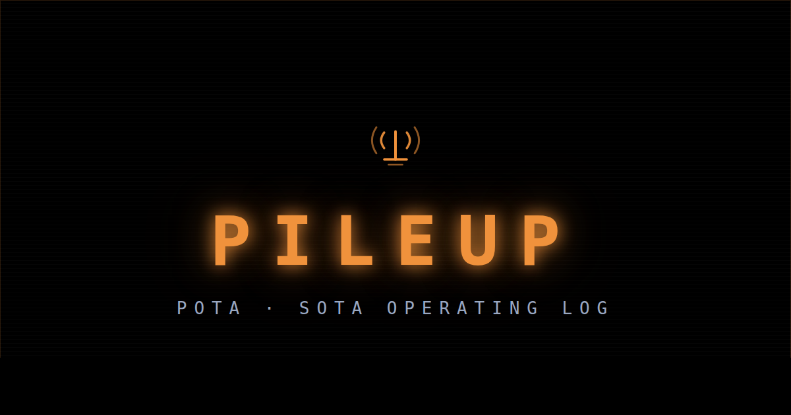
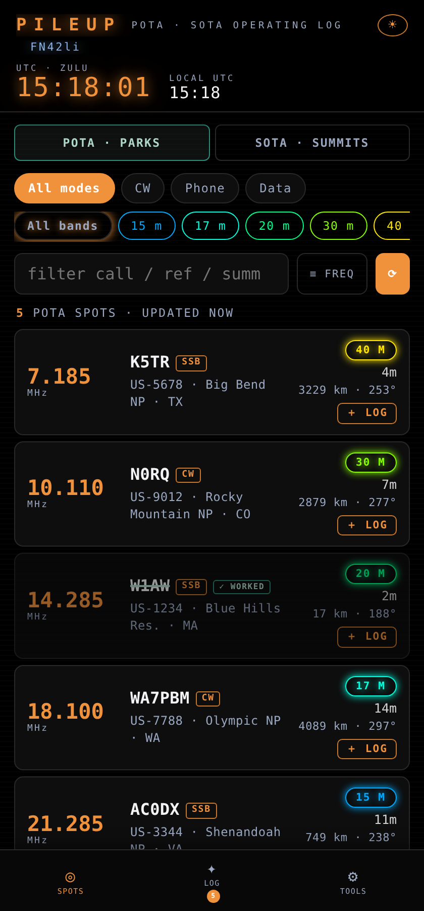
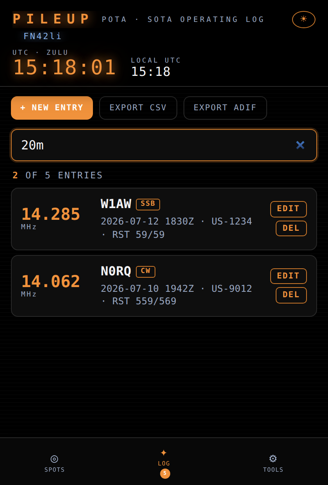

<div align="center">



# PileUp

**Live POTA &amp; SOTA spots and a full QSO logbook in a single-file PWA — installable, offline-capable, and account-free.**

[](https://github.com/cdburgess75/PileUp/actions/workflows/smoke.yml)
[](https://github.com/cdburgess75/PileUp/commits/main)
[](#architecture)
[](LICENSE)

**[▶ Open the live app](https://cdburgess75.github.io/PileUp/)**

</div>

---

## Table of contents

- [Overview](#overview)
- [Key features](#key-features)
- [Architecture](#architecture)
- [Getting started](#getting-started)
- [Usage](#usage)
- [Running the tests](#running-the-tests)
- [Contributing](#contributing)
- [License](#license)

---

## Overview

PileUp is an operating aid for amateur radio operators who hunt **Parks on the Air (POTA)** and **Summits on the Air (SOTA)** activations. It combines a live spot feed with a QSO logbook in one screen, so the chase-and-log loop is a single tap instead of a juggle between a spotting site and separate logging software.

**The problems it solves:**

| Problem | PileUp's answer |
|---|---|
| Spotting sites and loggers are separate tools | Tap **＋ log** on any spot — the QSO form is pre-filled with frequency, callsign, mode, and reference |
| Most loggers need accounts, installs, or licenses | One URL. No account, no tracking, no app store — data lives in your browser's local storage |
| Field operation means flaky or absent connectivity | Full PWA: installs to the home screen, caches its shell and last spot fetch, works offline |
| Working the same station twice wastes band time | Duplicate warning on entry, and worked callsigns are struck through in the spot list until the UTC day rolls over |
| Logs are useless if you can't get them out | One-tap **CSV** and **ADIF 3.1.4** export with `POTA_REF` / `SOTA_REF` tags for award submission |

**Why it stands out:** the entire application is one HTML file with zero runtime dependencies — no framework, no bundler, no build step. It loads fast on weak cell coverage, is auditable in a single read, and will still work when today's framework churn is long forgotten.

<div align="center">

| Live spots | Searchable logbook |
|:---:|:---:|
|  |  |

</div>

## Key features

| Area | Functionality |
|---|---|
| **Spot feed** | Live POTA + SOTA spots, auto-refreshed every 60 s (pauses when hidden or repeatedly failing) |
| **Filtering** | Band chips, mode chips (CW / Phone / Data), free-text search; sort by frequency or age; settings persist |
| **Navigation aids** | Distance (km) and bearing (°) to every activation, computed from your saved coordinates |
| **Worked tracking** | Logged callsigns struck through in the spot list until 0000 UTC; duplicate warning when logging |
| **Logbook** | Pre-filled entries from spots, manual entry, edit/delete, live band-aware search (`20m` matches 14 MHz) |
| **Export** | CSV (spreadsheet-ready) and ADIF 3.1.4 (`POTA_REF` / `SOTA_REF` included) |
| **Station tools** | Callsign + lat/lng + Maidenhead grid with GPS auto-locate |
| **UI** | Dark/light themes, three font sizes, 12/24 h clock, kiosk mode (fullscreen + wake-lock), UTC + local clocks |
| **Offline** | Service-worker shell cache, versioned; last spot fetch cached for offline reload |

## Architecture

```
PileUp/
├── index.html                   # The entire app — markup, styles, and logic in one file
├── sw.js                        # Service worker: versioned offline cache of the app shell
├── manifest.webmanifest         # PWA manifest (icons, theme, display mode)
├── icons/                       # App icons (SVG + PNG) and social-preview image
├── docs/                        # Screenshots used by this README
├── test/
│   └── smoke.mjs                # Smoke suite: syntax, DOM-id coverage, jsdom boot
└── .github/workflows/smoke.yml  # CI — runs the smoke suite on every push and PR
```

Inside `index.html`, the script section is organized as: constants and reference data (band plan, storage keys) → helpers (Maidenhead grid, haversine distance/bearing, formatting) → spot fetch/normalize/render → logbook CRUD and exports → station tools and preferences.

**Data flow:** spots are fetched from the public POTA and SOTA APIs. If a browser blocks the cross-origin request (common in iOS in-app browsers), the fetch falls back through a relay chain — allorigins → corsproxy.io → thingproxy.

| Source | Endpoint |
|---|---|
| POTA | `https://api.pota.app/spot/activator` |
| SOTA | `https://api-db2.sota.org.uk/api/spots/40/all` |

**Persistence:** everything is `localStorage` under `pileup_*_v1` keys (preferences, log, station location, cached spots). Nothing leaves the device except the spot-feed requests.

## Getting started

### As an operator (no install)

Open **<https://cdburgess75.github.io/PileUp/>** — that's it. To pin it as an app:

| Platform | Steps |
|---|---|
| iOS / iPadOS | Safari → Share → **Add to Home Screen** |
| Android | Chrome → ⋮ → **Add to Home Screen** |
| Desktop | Chrome / Edge → install icon in the address bar |

### As a developer

**Prerequisites:** [Node.js](https://nodejs.org/) ≥ 18 (for the test suite only — the app itself needs nothing but a browser). No API keys or environment variables are required.

```bash
git clone https://github.com/cdburgess75/PileUp.git
cd PileUp
npm install            # dev-only dependency: jsdom
npx serve .            # or python3 -m http.server — any static server works
```

Open `http://localhost:3000` (or just open `index.html` directly — the app runs from `file://` too, minus the service worker).

## Usage

1. **Set up your station** — Tools tab → enter your callsign, then tap **◉ Use GPS** (or type coordinates). Your Maidenhead grid is derived automatically and enables distance/bearing on every spot.
2. **Chase** — Spots tab → pick POTA or SOTA, narrow with band/mode chips or the search box. Fresh spots are bright; stale ones dim after 45 minutes.
3. **Log** — tap a spot, hit **＋ log**, add signal reports, save. Already-worked callsigns show struck through with a green ✓ until the UTC day rolls over.
4. **Search your log** — Log tab search matches callsign, reference, mode, date, notes, or band (`cw 20m` finds CW contacts on 14 MHz).
5. **Export** — Log tab → **Export CSV** for spreadsheets, **Export ADIF** for LoTW/QRZ/award submissions.

## Running the tests

```bash
npm test
```

The smoke suite (`test/smoke.mjs`) runs three checks in about a second:

| # | Check | Catches |
|---|---|---|
| 1 | Script parses (`new Function`) | Syntax errors anywhere in the app |
| 2 | Every `getElementById` call has a matching `id=""` | Typos between markup and logic |
| 3 | Full boot inside jsdom with stubbed `fetch`/`localStorage` | Runtime errors on startup, missing elements |

The same suite runs in CI on every push and pull request via [GitHub Actions](.github/workflows/smoke.yml).

## Contributing

Contributions are welcome. To keep the project true to its design goals:

1. **Open an issue first** for anything beyond a small fix, so the approach can be agreed before you invest time.
2. **Respect the constraints** — single file, zero runtime dependencies, no build step. If a feature needs a framework, it doesn't fit this project.
3. **Match the existing style** — compact vanilla JS, CSS custom properties for theming, `localStorage` for persistence.
4. **Run `npm test`** before pushing; CI runs the same suite on your PR.
5. Branch from `main`, keep PRs focused on one change, and include a screenshot for UI changes.

## License

Released under the [MIT License](LICENSE).

---

<div align="center">
<sub>73 📻</sub>
</div>
