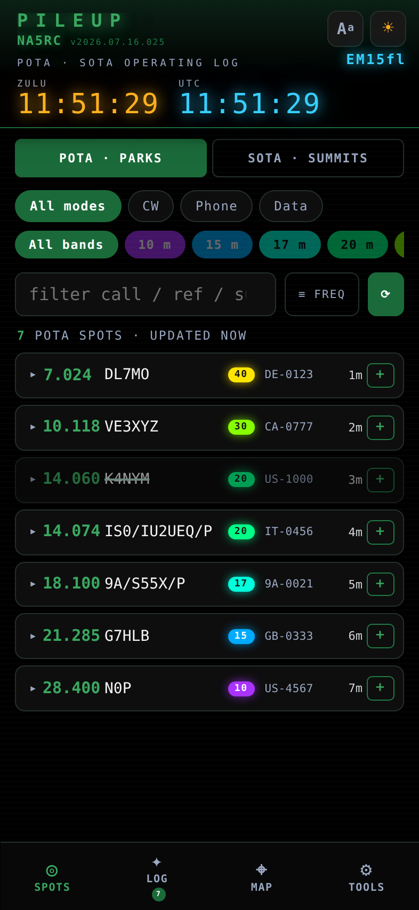
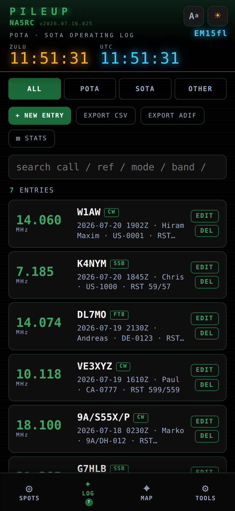
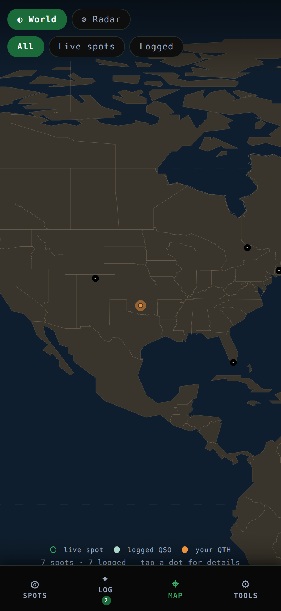
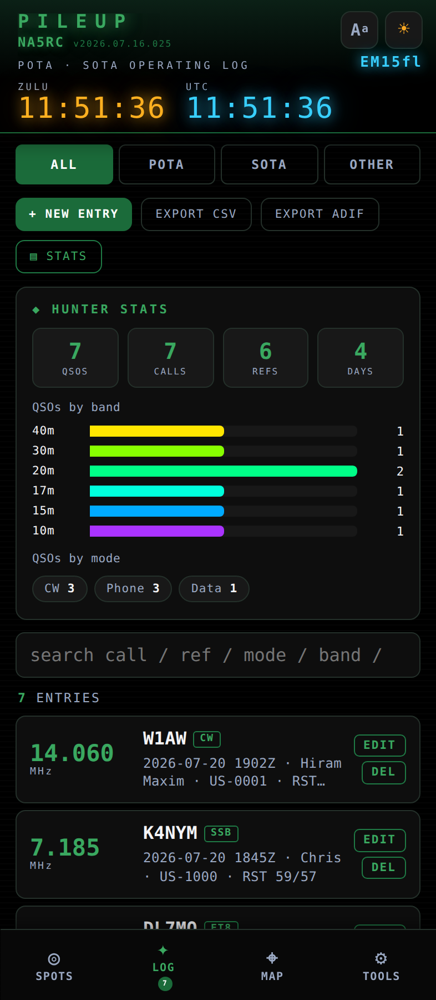
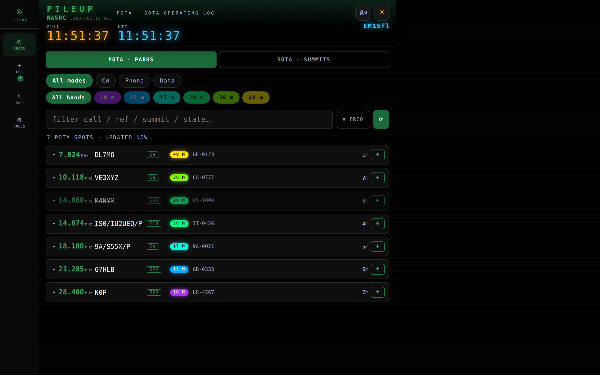

<div align="center">


# PileUp

### **Chase parks and summits, log the contact, never leave the page.**

Live POTA &amp; SOTA spots and a full QSO logbook in **one HTML file** — installable, offline-capable, and account-free.

<br>

<!-- ══════════════════════ PRIMARY CALL TO ACTION ══════════════════════ -->

<a href="https://cdburgess75.github.io/PileUp/">
  
</a>

**No install. No account. No sign-up.** It runs the moment it loads.

<br>

[](https://github.com/cdburgess75/PileUp/actions/workflows/smoke.yml)
[](CHANGELOG.md)
[](#-install-it-on-your-phone)
[](#architecture)
[](LICENSE)

<br>

<!-- ═══════════════════════════ HERO VISUAL ════════════════════════════
     REPLACE ME → `screenshots/hero.gif`
     Ideal asset: an 8–12 second screen recording at 390 × 844 (iPhone
     portrait), looping, under 8 MB so GitHub renders it inline.
     Show this exact sequence, it is the product in one loop:
       1. Spot list ticking over with live spots
       2. Tap a spot row to expand it (park name, distance, bearing)
       3. Tap ＋ log → the pre-filled QSO form → Save
       4. Swipe to the Map tab, spots plotted and band-coloured
     Until that exists, the static spot-list screenshot stands in.
     ──────────────────────────────────────────────────────────────────── -->



<sub><i>Live spots, dual UTC/local clocks, and one-tap logging — the whole chase loop on one screen.</i></sub>

</div>

---

## Table of contents

- [Why PileUp](#why-pileup)
- [Core features](#core-features)
- [Screenshots](#screenshots)
- [Tech stack](#tech-stack)
- [Quick start](#quick-start)
- [📱 Install it on your phone](#-install-it-on-your-phone)
- [Using PileUp](#using-pileup)
- [Architecture](#architecture)
- [Running the tests](#running-the-tests)
- [Contributing](#contributing)
- [License](#license)

---

## Why PileUp

PileUp is an operating aid for amateur radio operators who hunt **Parks on the Air (POTA)** and **Summits on the Air (SOTA)** activations. It puts a live spot feed and a QSO logbook on the same screen, so the chase-and-log loop is a single tap instead of a juggle between a spotting site and separate logging software.

| The problem | PileUp's answer |
|---|---|
| Spotting sites and loggers are separate tools | Tap **＋ log** on any spot — the QSO form opens pre-filled with frequency, callsign, mode, and reference |
| Most loggers want an account, an install, or a licence | One URL. No account, no tracking, no app store — data lives in your browser |
| Field operation means flaky or absent connectivity | A real PWA: installs to the home screen, caches its shell and last spot fetch, works with no signal |
| Working the same station twice wastes band time | Worked callsigns are struck through until 0000 UTC, plus a duplicate warning when you log |
| A log is useless if you can't get it out | One-tap **CSV** and **ADIF 3.1.4** export, ready for LoTW, QRZ, Club Log, or POTA |

> **The whole application is one HTML file with zero runtime dependencies** — no framework, no bundler, no build step. It loads fast on weak cell coverage, is auditable in a single read, and will still run long after today's framework churn is forgotten.

---

## Core features

**📡 Live spots**
- POTA and SOTA feeds in compact, expandable rows — frequency, callsign, mode, band, reference, age
- A third **\*OTA** tab for the long tail — WWFF, GMA, WWBOTA, HEMA, WOTA, ZLOTA, LLOTA, WWTOTA and more — each row tagged with its programme
- Auto-refreshes every 60 s, pauses when hidden, and backs off when a feed is failing
- Filter by band chips, mode (CW / Phone / Data), or free text; sort by frequency or age

**📖 Logbook**
- One-tap logging from any spot, or add contacts by hand
- **Callsign lookup** — press Enter on a call to auto-fill the operator's name, QTH, and grid
- Band-aware search: `20m` matches 14 MHz, `cw 20m` narrows to both
- Duplicate detection, edit and delete, and worked-today tracking

**🧭 Navigation &amp; map**
- Distance in km and **true bearing in degrees** to every activation, from your saved coordinates
- Full-screen world map with country borders plus US state and Canadian province lines
- An azimuthal **"QTH radar"** view where a marker's angle is the heading to point your antenna
- Pinch, zoom, and pan; tap any marker for full detail and a **＋ Log** button — all with **zero network calls**

**📤 Getting your data out**
- **CSV** for spreadsheets and **ADIF 3.1.4** for LoTW, QRZ, Club Log, and POTA
- Correct programme tags: `POTA_REF` / `SOTA_REF` where they belong, standard `SIG` / `SIG_INFO` everywhere else
- One-tap JSON backup, and restore from that backup *or* an ADIF file from other software, with duplicate-safe merging

**🛠 Station tools**
- Callsign, latitude/longitude, and Maidenhead grid with GPS auto-locate
- **Spot yourself** — activating? Compose your spot once, and a QSY is a single edit
- Dark and light themes, three font sizes, 12/24-hour clock, and a **kiosk mode** with screen-wake for a shack dashboard

**⚡ Built to survive the field**
- Installs to the home screen and **works offline**
- Responsive from a 320 px phone to a desktop browser — rows shed columns under pressure so a **full callsign is never truncated**
- Everything stays on your device; nothing leaves it but the spot requests

<details>
<summary><b>Full feature matrix</b> (click to expand)</summary>

<br>

| Area | Functionality |
|---|---|
| **Spot feed** | Live POTA + SOTA spots in compact expandable rows, auto-refreshed every 60 s (pauses when hidden or repeatedly failing) |
| **\*OTA programmes** | A third tab covering the long tail — WWFF, GMA, WWBOTA, HEMA, WOTA, ZLOTA, LLOTA, WWTOTA and more — via the [Spothole](https://spothole.app) aggregator, each row tagged with its programme. POTA and SOTA keep their own direct feeds so the core never depends on a third party |
| **Filtering** | Band chips, mode chips (CW / Phone / Data), free-text search; sort by frequency or age; settings persist |
| **Navigation aids** | Distance (km) and bearing (°) to every activation, computed from your saved coordinates |
| **Worked tracking** | Logged callsigns struck through in the spot list until 0000 UTC; duplicate warning when logging |
| **Logbook** | Pre-filled entries from spots, manual entry, edit/delete, live band-aware search (`20m` matches 14 MHz) |
| **Callsign lookup** | Type a call in the log form and press Enter to auto-fill the operator's name plus QTH/grid (free public database, keyless) |
| **Hunter stats** | QSOs, unique calls, refs, active days; per-band bars and per-mode counts, live from the log |
| **Map** | Full-screen world map (country borders worldwide + US state / Canadian province lines) + azimuthal "QTH radar" views of live spots and logged contacts — band-coloured, pinch/zoom/pan, embedded, zero network needed |
| **Export** | CSV (spreadsheet-ready) and ADIF 3.1.4 — `POTA_REF` / `SOTA_REF` for those programmes, standard `SIG` / `SIG_INFO` for every other one |
| **Data safety** | One-tap JSON backup of everything; restore or import ADIF logs with duplicate-safe merging; persistent-storage request |
| **Station tools** | Callsign + lat/lng + Maidenhead grid with GPS auto-locate |
| **Spot yourself** | Activating? Compose your spot once — PileUp remembers it, so a QSY is one edit — then copy it and open POTA or SOTAwatch to post. Reference and band are sanity-checked as you type |
| **UI** | Dark/light themes, three font sizes, 12/24 h clock, kiosk mode (fullscreen + wake-lock); dual UTC (Zulu) + local LED clocks with seconds |
| **Responsive** | One layout from 320 px phones to desktop — bottom nav on mobile, a left sidebar on wide screens; spot rows shed columns to keep full callsigns visible |
| **Offline** | Service-worker shell cache, versioned; last spot fetch cached for offline reload |

</details>

---

## Screenshots

<div align="center">

<!-- ══════════════════════ SCREENSHOT ROW ══════════════════════
     REPLACE ME → screenshots/log.png, map.png, stats.png
     Capture at 390 × 844 (iPhone portrait) with realistic seeded
     data — a dozen QSOs across several bands, so the stat bars and
     map markers actually have something to show.
     ─────────────────────────────────────────────────────────── -->

| Logbook | Map with borders | Hunter stats |
|:---:|:---:|:---:|
|  |  |  |

<br>

<!-- ══════════════════════ DESKTOP / WIDE ══════════════════════
     REPLACE ME → screenshots/desktop.png
     Capture at 1440 × 900 so the left sidebar and the roomy
     spot rows are both visible.
     ─────────────────────────────────────────────────────────── -->



<sub><i>One responsive layout — bottom tab bar on phones, a left sidebar on wide screens.</i></sub>

<br><br>

<!-- ══════════════════════ LIGHT THEME ══════════════════════
     ADD ME → screenshots/light-theme.png
     There is no light-mode screenshot yet, and the "Tactical
     Document" light theme is one of the app's nicest touches —
     forest-green headers, burnt-amber Zulu clock, ice-grey
     hairline borders on crisp paper. Capture the Spots tab at
     390 × 844 with the theme toggled to ☀ Light.
     ───────────────────────────────────────────────────────── -->

</div>

### 🎨 Visual asset checklist

Everything the README wants, and exactly where each file lands:

| File | Status | What to capture | Suggested size |
|---|---|---|---|
| `screenshots/hero.gif` | **Missing** | 8–12 s loop: spots ticking → expand a row → ＋ log → map | 390 × 844, < 8 MB |
| `screenshots/spots.png` | Needs refresh | Spots tab — currently shows an older build | 390 × 844 |
| `screenshots/log.png` | Needs refresh | Log tab with a dozen realistic QSOs | 390 × 844 |
| `screenshots/map.png` | Needs refresh | World map, spots and logs plotted | 390 × 844 |
| `screenshots/stats.png` | Needs refresh | Stats dashboard with populated bars | 390 × 844 |
| `screenshots/desktop.png` | Needs refresh | Wide layout with the left sidebar | 1440 × 900 |
| `screenshots/light-theme.png` | **Missing** | Spots tab in the light theme | 390 × 844 |
| `icons/og-image.png` | ✅ Current | Social preview card | 1200 × 630 |

---

## Tech stack

<p align="center">
  
  
  
  
  <br>
  
  
  
  
</p>

<p align="center">
  
  
</p>

**No framework. No bundler. No build step.** That's the design constraint, not an oversight:

| Layer | Choice | Why |
|---|---|---|
| UI | Vanilla JS in a single `<script>` block | Nothing to install, nothing to compile, auditable in one read |
| Styling | CSS custom properties, dark + light themes | Theme switching with no JS re-render |
| Maps | Hand-rolled inline SVG (equirectangular + azimuthal) | No mapping library, no tile server, works fully offline |
| Storage | `localStorage` under `pileup_*_v1` keys | No backend, no account, data never leaves the device |
| Offline | Versioned service worker | App shell and last spot fetch survive a dead connection |
| Hosting | GitHub Pages, deployed from `main` | Static files, no server to run or pay for |
| Testing | Node ≥ 18 + jsdom | **The only dependency in the project — and it is dev-only** |

---

## Quick start

You do **not** need any of this to use PileUp — just [open the live app](https://cdburgess75.github.io/PileUp/). This is for running it locally or hacking on it.

### Prerequisites

| Requirement | Needed for | Notes |
|---|---|---|
| Any modern browser | Running the app | That's genuinely all the app needs |
| [Node.js](https://nodejs.org/) ≥ 18 | The test suite only | Not required to run the app |

No API keys. No environment variables. No `.env` file.

### 1. Clone

```bash
git clone https://github.com/cdburgess75/PileUp.git
cd PileUp
```

### 2. Install

```bash
npm install
```

> Installs exactly one dev-only package — **jsdom**, used to boot the app headlessly in the smoke tests. The app itself ships zero runtime dependencies.

### 3. Run

```bash
npx serve .
# or, with no Node at all:
python3 -m http.server 8000
```

Then open **<http://localhost:3000>** (or `:8000` for the Python server).

> **Why a server rather than opening the file?** `index.html` runs fine straight from `file://`, but service workers require `http://` or `https://` — so offline mode and the update banner only work when it's served.

### 4. Test

```bash
npm test
```

Four checks, about a second. See [Running the tests](#running-the-tests).

---

## 📱 Install it on your phone

PileUp is a full Progressive Web App. Installing it gives you a home-screen icon, a fullscreen app window with no browser chrome, and **offline access** — which is the point when you're stood in a park with one bar of signal.

<div align="center">

<!-- ══════════════════════ INSTALL WALKTHROUGH ══════════════════════
     ADD ME → screenshots/install-ios.png and screenshots/install-android.png
     Two side-by-side captures showing the Share sheet with "Add to
     Home Screen" highlighted (iOS) and the Chrome ⋮ menu with
     "Install app" highlighted (Android). Annotate with an arrow or
     a coloured ring so the tap target is unmistakable.
     ──────────────────────────────────────────────────────────────── -->

</div>

###  &nbsp;Safari

Apple doesn't allow one-tap installs, so this is a manual — but quick — three-step process.

1. Open **<https://cdburgess75.github.io/PileUp/>** in **Safari**.
   *It must be Safari — Chrome and in-app browsers on iOS can't add to the home screen.*
2. Tap the **Share** button — the square with an arrow pointing up, at the bottom of the screen.
3. Scroll down the share sheet and tap **Add to Home Screen**, then **Add** in the top-right.

PileUp now sits on your home screen with its own icon and opens fullscreen, without the Safari address bar.

###  &nbsp;Chrome

1. Open **<https://cdburgess75.github.io/PileUp/>** in **Chrome**.
2. Either tap the **⬇ Install** button PileUp offers you, **or** open the **⋮** menu (top-right) and choose **Install app** / **Add to Home screen**.
3. Confirm with **Install**.

Chrome usually prompts you on its own after a few seconds — one tap and you're done.

###  &nbsp;Chrome, Edge, Brave

Click the **install icon** in the address bar (a monitor with a downward arrow), or use **⋮ → Cast, save and share → Install page as app**. PileUp opens in its own window — handy as a permanent shack dashboard alongside **Kiosk mode**.

### Sharing it with another operator

Open **Tools → ◆ Share PileUp** for a **QR code**. Point another phone's camera at it and PileUp opens instantly — no app store, no link to type out.

### After installing

- **Updates** — when a new version deploys, a banner slides up from the bottom. Tap **⬆ Update** to apply it. You're always told; it never swaps out underneath you.
- **Offline** — the app shell and your last spot fetch are cached, so PileUp opens and your log stays fully usable with no signal.
- **Your data** — lives in the browser's storage on that device. Use **Tools → ⬇ Backup** before changing phones.

---

## Using PileUp

Four tabs along the bottom: **Spots**, **Log**, **Map**, and **Tools**. Your version is shown under the **PILEUP** title.

### First run — set up your station

Do this once so distances, bearings, and your grid square work everywhere.

1. Open **Tools → ◆ My station**.
2. Enter your **callsign**.
3. Tap **◉ Use GPS**, or type latitude/longitude by hand.
4. Tap **Save**. Your Maidenhead grid (e.g. `FN42li`) appears in the header, and every spot now shows its distance and bearing from you.

### Spots tab — find and log activations

- **Pick a programme:** **POTA · Parks**, **SOTA · Summits**, or **\*OTA · More**.
- **Rows are collapsed** to one line by default. **Tap a row to expand** for park name, distance, bearing, and comments.
- **Tap ＋ to log** — the QSO form opens pre-filled with frequency, callsign, mode, and reference. Add signal reports and **Save**.
- **Narrow the list** with mode chips, colour-coded band chips, or the search box.
- **Worked indicator:** anything you've logged today (UTC) is struck through with a green ✓ until 0000 UTC.
- Auto-refreshes every 60 s; ⟳ forces it. Spots older than 45 minutes dim.

### Log tab — your logbook

- **Filter by programme** with the **All / POTA / SOTA / Other** switch.
- **Search** across callsign, reference, mode, date, notes, frequency, and band — multiple terms narrow further.
- **+ New entry** adds a contact by hand; the form remembers your last frequency and mode.
- **Callsign lookup:** type a call and press **Enter** to fill the operator's name and show their QTH and grid. A name you've typed is never overwritten.
- **▤ Stats** opens a live dashboard of QSOs, unique calls, unique references, active days, per-band bars, and per-mode counts.
- **Export CSV** for spreadsheets, **Export ADIF** for LoTW, QRZ, Club Log, and POTA.

### Map tab — see where the activity is

- **World** shows everything geographically; **Radar** is an azimuthal view centred on you, where a marker's angle is the **true bearing to point your antenna**.
- **Hollow rings are live spots** (coloured by band), **green dots are logged contacts**, **the amber dot is you**.
- Pinch to zoom out to the whole globe or in close, drag to pan, double-tap to zoom. **⟲** recentres on you.
- **Tap any marker** for full detail plus a **＋ Log** button.

### Spot yourself — if you're the activator

**Tools → ◆ Spot yourself** composes a spot from your saved callsign:

1. Pick **POTA · Park** or **SOTA · Summit**.
2. Enter your **reference** (`US-1234` or `W5/LO-001`), **frequency** in kHz, **mode**, and an optional **comment**.
3. The preview line shows exactly what you'll post, with the band alongside. Bad reference formats and out-of-band frequencies are flagged as **warnings, never blocks**.
4. **⇗ Post** copies the line and opens POTA or SOTAwatch; paste it into their form. **⧉ Copy** just copies — handy for texting a spot to a friend.

Details are remembered per programme, so re-spotting after a QSY means changing the frequency and tapping **⇗ Post** again.

> **PileUp doesn't submit the spot for you.** Both spot APIs need an authenticated session, and a static page with no backend has nowhere safe to keep one — so posting hands off to the site you're already signed in to.

### Protect your log

Your log lives in the browser, so back it up. **Tools → ⬇ Backup** saves a JSON file of your whole log, station, and settings. **⬆ Restore / Import** reads that back *or* an ADIF file from other software — contacts merge in, duplicates are skipped, your station is never overwritten.

### Submitting logs

PileUp doesn't sync to POTA. **Export ADIF** and upload that file — the **Tools → Upload / submit logs** card links straight to POTA, QRZ, LoTW, and Club Log. Note that **POTA hunter credit is automatic** once the activator uploads their log; you only submit if *you* activated.

---

## Architecture

```
PileUp/
├── index.html                   # The entire app — markup, styles, and logic in one file
├── sw.js                        # Service worker: versioned offline cache of the app shell
├── manifest.webmanifest         # PWA manifest (icons, theme, display mode)
├── icons/                       # App icons (SVG + PNG) and social-preview image
├── screenshots/                 # Screenshots used by this README
├── test/
│   └── smoke.mjs                # Smoke suite: syntax, DOM-id coverage, jsdom boot, version sync
└── .github/workflows/smoke.yml  # CI — runs the smoke suite on every push and PR
```

Inside `index.html`, the script is organised as: constants and reference data (band plan, storage keys) → helpers (Maidenhead grid, haversine distance/bearing, formatting) → spot fetch/normalise/render → logbook CRUD and exports → station tools and preferences.

**Data flow.** Spots come from the public POTA and SOTA APIs. If a browser blocks the cross-origin request (common in iOS in-app browsers), the fetch falls back through a relay chain — allorigins → corsproxy.io. A `Content-Security-Policy` meta tag pins network access to exactly these hosts.

| Source | Endpoint |
|---|---|
| POTA | `https://api.pota.app/spot/activator` |
| SOTA | `https://api-db2.sota.org.uk/api/spots/40/all` |
| \*OTA | `https://spothole.app` (aggregates WWFF, GMA, WWBOTA, HEMA and more) |

POTA and SOTA deliberately keep their **own direct feeds** rather than being routed through the aggregator — they're the two programmes the app is built around, and putting them behind a third party would make the core feature depend on someone else's uptime.

**Persistence.** Everything is `localStorage` under `pileup_*_v1` keys — preferences, log, station location, cached spots. Nothing leaves the device except the spot-feed requests.

**Versioning.** `YYYY.MM.DD.NNN`, kept in lockstep across `index.html`, `sw.js`, this README's badge, and `package.json`. Smoke test 4 fails CI if they drift. See [CHANGELOG.md](CHANGELOG.md).

---

## Running the tests

```bash
npm test
```

| # | Check | Catches |
|---|---|---|
| 1 | Script parses (`new Function`) | Syntax errors anywhere in the app |
| 2 | Every `getElementById` has a matching `id=""` | Typos between markup and logic |
| 3 | Full boot in jsdom with stubbed `fetch`/`localStorage` | Runtime errors on startup, missing elements |
| 4 | `VERSION` === `sw.js` cache name === README badge | Version drift between app, cache, and docs |

The same suite runs in CI on every push and pull request via [GitHub Actions](.github/workflows/smoke.yml).

---

## Contributing

Contributions are welcome. To keep the project true to its design goals:

1. **Open an issue first** for anything beyond a small fix, so the approach can be agreed before you invest time.
2. **Respect the constraints** — single file, zero runtime dependencies, no build step. If a feature needs a framework, it doesn't fit here.
3. **Match the existing style** — compact vanilla JS, CSS custom properties for theming, `localStorage` for persistence.
4. **Run `npm test`** before pushing; CI runs the same suite on your PR.
5. Branch from `main`, keep PRs focused, and include a screenshot for UI changes.

---

## License

Released under the [MIT License](LICENSE).

Spot data comes from [POTA](https://pota.app), [SOTA](https://www.sotadata.org.uk), and [Spothole](https://spothole.app) — thank you to everyone who runs those services.

---

<div align="center">

### **[▶ Open the live app](https://cdburgess75.github.io/PileUp/)**

<sub>Built for operators who'd rather be outside. 73 📻</sub>

</div>
